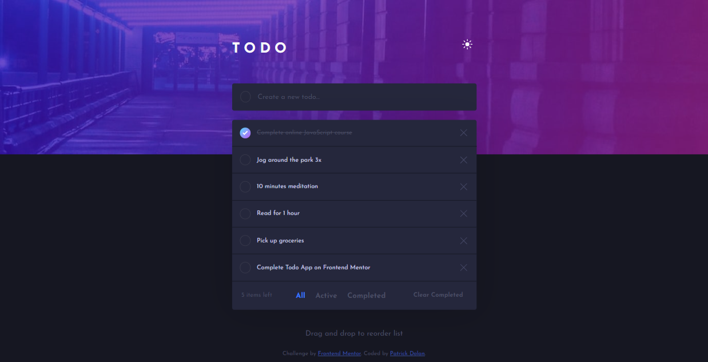

# Frontend Mentor - Todo app solution

This is a solution to the [Todo app challenge on Frontend Mentor](https://www.frontendmentor.io/challenges/todo-app-Su1_KokOW). Frontend Mentor challenges help you improve your coding skills by building realistic projects. 

## Table of contents

- [Overview](#overview)
- [The challenge](#the-challenge)
- [Screenshot](#screenshot)
- [Links](#links)
- [Built with](#built-with)
- [Author](#author)

## Overview

### The challenge

Users should be able to:

- View the optimal layout for the app depending on their device's screen size
- See hover states for all interactive elements on the page
- Add new todos to the list
- Mark todos as complete
- Delete todos from the list
- Filter by all/active/complete todos
- Clear all completed todos
- Toggle light and dark mode
- **Bonus**: Drag and drop to reorder items on the list

### Screenshot

*More screenshots can be found in the screenshots folder at the root of the directory of the project.*

### Links

- Solution URL: [Source Code](https://github.com/Patrick-Dolan/FM-todo)
- Live Site URL: [Add live site URL here](https://your-live-site-url.com)

### Built with

- HTML, CSS, and Basic JavaScript
- Mobile-first workflow

## Author

- Website - [Patrick Dolan](https://patrickdolan.dev/)
- Frontend Mentor - [@Patrick-Dolan](https://www.frontendmentor.io/profile/Patrick-Dolan)